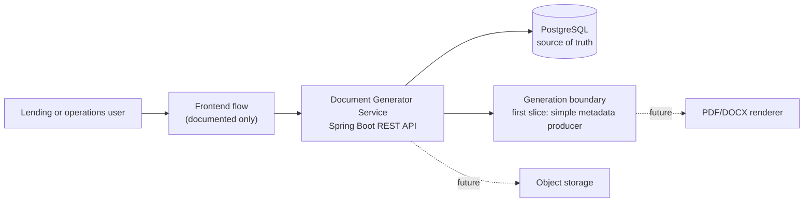
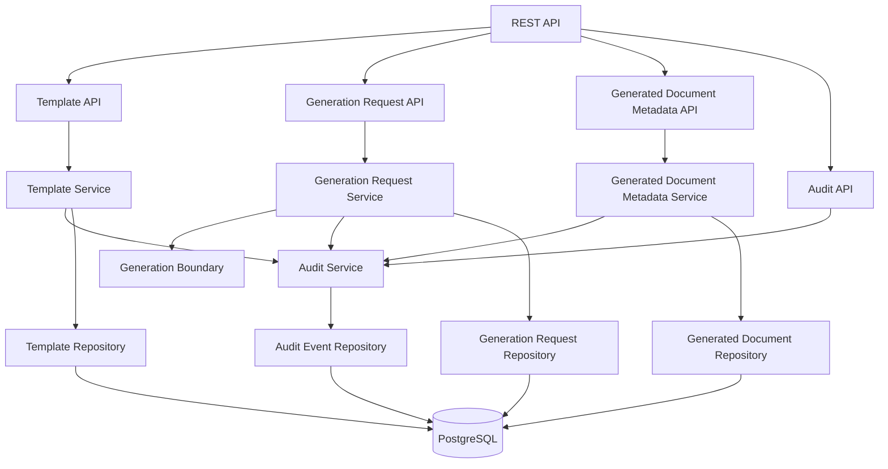
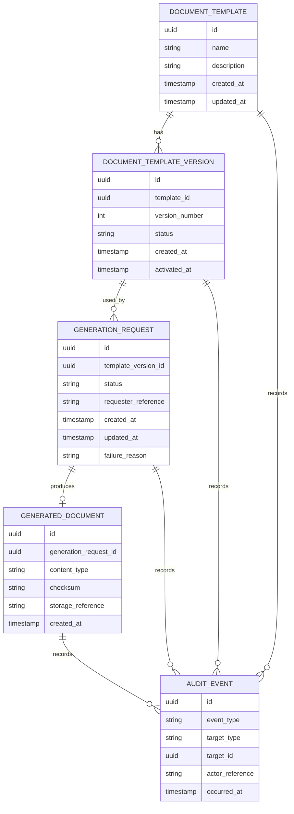
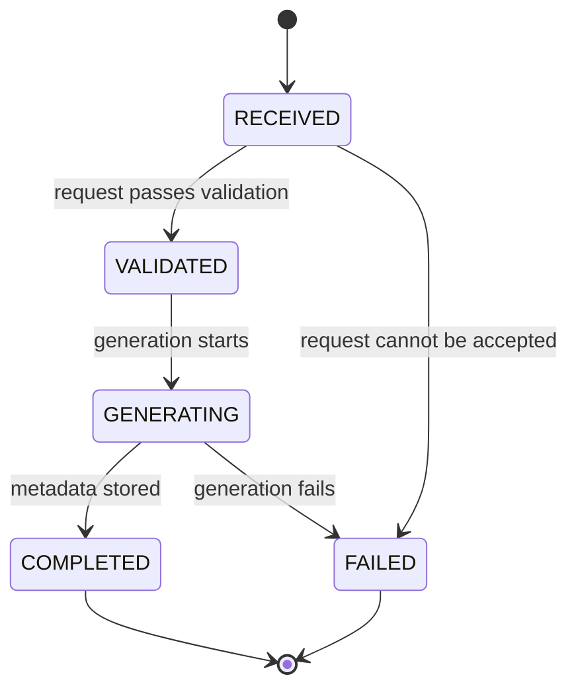
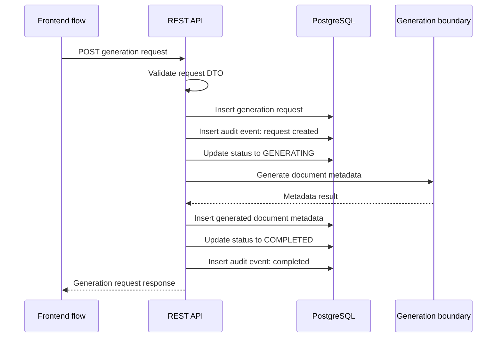
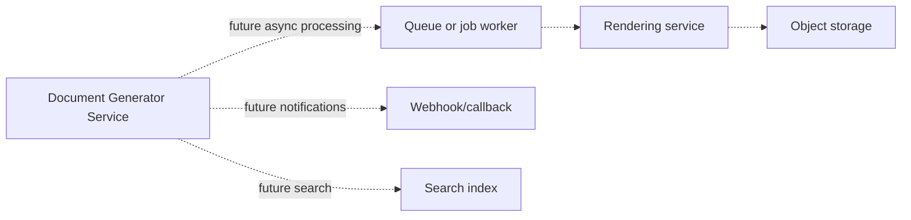

# Diagrams

These diagrams describe the first implemented Document Generator Service backend slice and the future seams that remain deliberately out of scope.

## System context

## Backend components

## Core data relationships

The core model uses five first-class concepts: document templates, template versions, generation requests, generated document metadata, and audit events.

## Generation request lifecycle

## First-slice sequence

## Future production extensions

These extensions are intentionally not part of the first implementation slice. They are useful discussion points only after the core lifecycle is implemented and tested.
