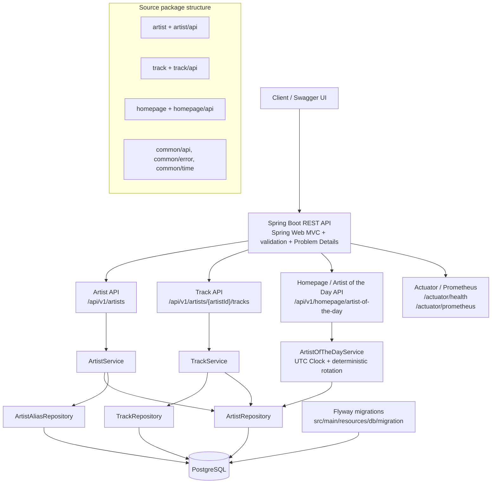
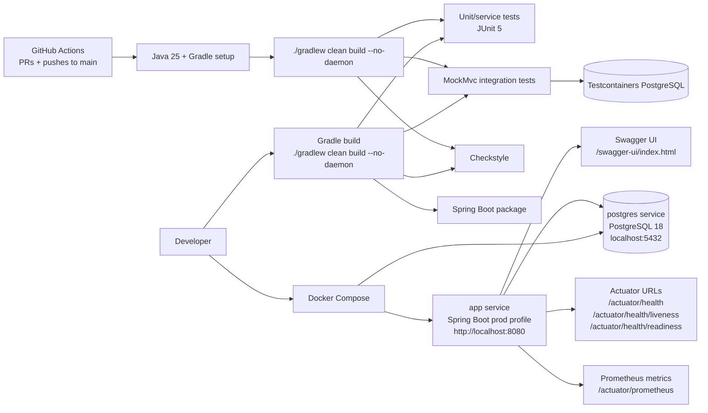
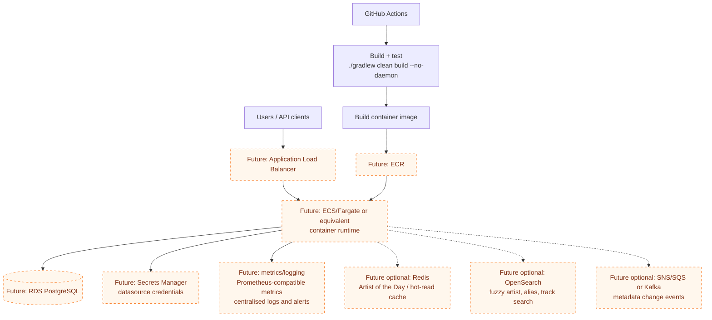

# Architecture Diagrams and Presentation Notes

These diagrams are reviewer aids for the current take-home implementation. Future infrastructure is labelled explicitly and is not implemented in this repository.

## Current application architecture

## Local runtime and CI/testing setup

## Future production architecture (not implemented)

## 15-minute presentation outline

1. **Problem understanding (1 minute)**
   - Build a pragmatic music metadata API for canonical artists, aliases, tracks, and a homepage Artist of the Day.
   - Keep the scope useful for a streaming-platform-like product without adding unrelated platform features.

2. **Domain model (2 minutes)**
   - `Artist` is the stable canonical identity with a primary display name.
   - `ArtistAlias` is explicit metadata linked to an artist, not a separate artist.
   - `Track` belongs to exactly one artist and is retrieved with bounded pagination.
   - Artist of the Day rotates over canonical artists only, so aliases do not skew fairness.

3. **API walkthrough (3 minutes)**
   - Create, fetch, and update artists.
   - Add and list aliases.
   - Add and page through tracks for an artist.
   - Fetch `/api/v1/homepage/artist-of-the-day` and inspect contracts in Swagger UI.
   - Show validation, duplicate handling, and Problem Details-style error responses.

4. **Architecture (3 minutes)**
   - Package-by-feature modular monolith: artist, track, homepage, and common support packages.
   - Controller to service to repository flow keeps the implementation readable.
   - PostgreSQL is the source of truth; Flyway owns schema changes; Hibernate validates only.
   - Actuator and Prometheus endpoints provide basic operational visibility.

5. **Testing and production readiness (2 minutes)**
   - Unit/service tests cover business rules such as alias handling, track normalisation, and Artist of the Day determinism.
   - MockMvc and Testcontainers PostgreSQL tests cover real API and database behaviour.
   - GitHub Actions runs the same clean Gradle build as the local quality gate.
   - Docker Compose supports local app plus PostgreSQL runtime checks.

6. **Trade-offs (2 minutes)**
   - Modular monolith instead of microservices because the domain is small and tightly related.
   - Page-based pagination is simple and bounded; cursor pagination is a future option for very large catalogues.
   - Artist of the Day is computed on request for simplicity; production could precompute or cache once per UTC day.
   - Authentication, search, messaging, and distributed caching are intentionally out of take-home scope.

7. **Next improvements (2 minutes)**
   - Add OAuth2/OIDC and scope-protected write operations.
   - Add a production deployment path such as ECR, ECS/Fargate, RDS, Secrets Manager, dashboards, and alerts.
   - Add read optimisation where justified: daily cache/precompute, read replicas, or cursor pagination.
   - Add OpenSearch or messaging only when product needs or integration consumers require them.
